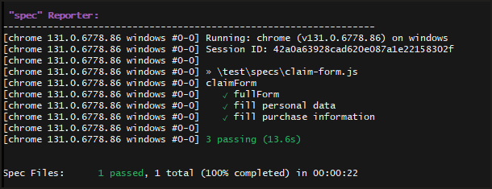

# Thinklogic Test
Testing scrip designed to verify functionality of the form on the webpage and the back-end data capture.

Created for the purposes of Thinklogic Assesment.

# Instructions

◊ Download and install latest versions of Git and Node.js

◊ Clone repository

    git clone https://github.com/gicutieri/thinklogic-test.git
    cd ./thinklogic-test

◊ Run tests

    npx wdio

# Expected results:

